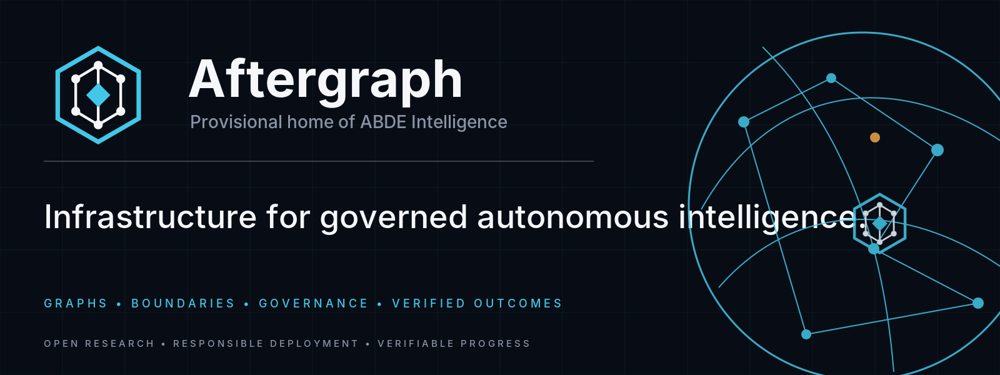
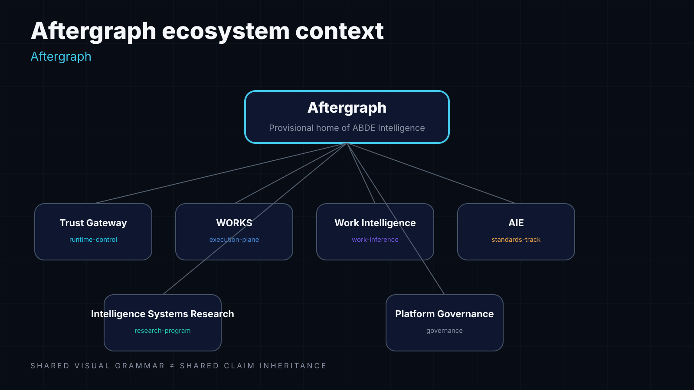
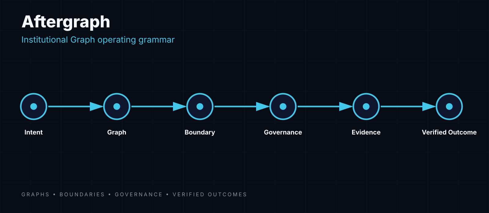

<p align="center">
  <picture>
    <source media="(prefers-color-scheme: dark)" srcset="./assets/hero.webp">
    
  </picture>
</p>

<h1 align="center">Aftergraph</h1>
<p align="center"><strong>Infrastructure and open research for verifiable intelligent systems.</strong></p>
<p align="center">Missions · Authority · Durable Execution · Evidence · Verification · Agentic Institutions</p>

Aftergraph is an engineering and research organization working on the systems layer around autonomous AI: how long-running agents can execute real work while preserving bounded authority, durable state, measurable cost, machine-verifiable evidence, and independently verified outcomes.

> **Intelligence that can act. Systems that can prove why.**
>
> 📡 **Public Knowledge Plane live:** [docs.aftergraph.org](https://docs.aftergraph.org) — architecture, contracts, claims with evidence strength, API reference, and agent-readable context packs, all provenance-stamped to exact source commits.

## Start here

| If you care about… | Start with | What it contains |
|---|---|---|
| **Verifiable long-horizon agents** | [`intelligence-systems-research`](https://github.com/Aftergraph/intelligence-systems-research) | Mission Contract research, MISSION-Bench, conformance, reference runtimes, reproducibility |
| **Authority, delegation & institution semantics** | [`aie`](https://github.com/Aftergraph/aie) | Agentic Institution Engineering Draft 0.3, authority leases, revocation, budgets, evidence semantics |
| **Runtime enforcement** | [`trust-gateway`](https://github.com/Aftergraph/trust-gateway) | Trust and control boundary for governed autonomous execution |
| **Durable autonomous work** | [`works-execution`](https://github.com/Aftergraph/works-execution) | Mission execution, budgets, evidence, lifecycle and durable work primitives |
| **Work inference** | [`work-intelligence-v2`](https://github.com/Aftergraph/work-intelligence-v2) | Source-neutral observation → structured WorkItem inference |
| **Cross-repo contracts & truth** | [`after-graph-governance`](https://github.com/Aftergraph/after-graph-governance) | Canonical contracts, terminology, exact-head state and claim boundaries |

**Direct public entry points:** [Research papers](https://github.com/Aftergraph/intelligence-systems-research/tree/main/PAPERS) · [AIE specification](https://github.com/Aftergraph/aie) · [Contributing](https://github.com/Aftergraph/.github/blob/main/CONTRIBUTING.md) · [Security](https://github.com/Aftergraph/.github/blob/main/SECURITY.md) · [Support](https://github.com/Aftergraph/.github/blob/main/SUPPORT.md)

## What we are trying to solve

Most agent stacks are good at producing actions. Production systems need more than action generation:

```text
human intent
    ↓
mission contract
    ↓
state + capabilities + authority + budget
    ↓
execution + recovery
    ↓
evidence
    ↓
independent verification
    ↓
verified outcome
```

The core design rule is simple: **an agent saying “done” is not the same thing as the system proving the outcome.**

## Research programs

### Intelligence Systems Research

The research program investigates a vendor-neutral systems contract connecting human intent to persistent, governed and verifiable outcomes across heterogeneous models, agents, tools and runtimes.

Current public work includes:

- **SPEC-001 / Mission Contract** — machine-readable mission, state, capability, authority, budget, trajectory, evidence and verifier semantics.
- **MISSION-Bench** — fault-injected evaluation of long-horizon intelligent systems.
- **Evidence-gated completion** — `Complete ≠ Verified` as a normative system invariant.
- **Attenuated authority** — scoped, expiring and purpose-bound delegation rather than ambient credentials.
- **Cost Per Verified Outcome (CPVO)** — evaluation of useful verified work instead of raw inference price alone.
- **Cross-runtime conformance** — portable semantics rather than framework-specific governance glue.

Scientific claims remain bounded by the evidence class stated in the research repository. Deterministic sandbox results, live-provider results, simulations and external reproduction are not treated as interchangeable evidence.

### Agentic Institution Engineering (AIE)

AIE investigates the engineering layer above graph coordination and runtime control:

> **Graph defines coordination. Control enforces execution. Institution resolves legitimate authority.**

AIE focuses on portable semantics for principals, roles, authority, delegation, mission contracts, budgets, revocation, lifecycle, governed topology mutation and evidence. It is currently a **Research Draft / experimental standards track**, not a declared industry standard.

## Architecture

<p align="center"></p>

<p align="center"></p>

```text
graphs → boundaries → authority → execution → evidence → verified outcomes
```

Aftergraph intentionally composes existing standards and protocols where they already solve a problem. The goal is not to invent another transport, identity system or telemetry format merely because the industry was apparently short on acronyms.

## Public repositories

| Repository | Role |
|---|---|
| [`Aftergraph/aftergraph.org`](https://github.com/Aftergraph/aftergraph.org) | Public platform surface — landing, system launcher, health and agent index (aftergraph.org) |
| [`Aftergraph/docs`](https://github.com/Aftergraph/docs) | **Knowledge Plane** — public docs/research portal with provenance, freshness and machine-readable surfaces · live at [docs.aftergraph.org](https://docs.aftergraph.org) |
| [`Aftergraph/aie`](https://github.com/Aftergraph/aie) | Agentic Institution Engineering specification, conformance and interoperability |
| [`Aftergraph/intelligence-systems-research`](https://github.com/Aftergraph/intelligence-systems-research) | Research program, benchmark, papers, experiments and reference runtime |
| [`Aftergraph/after-graph-governance`](https://github.com/Aftergraph/after-graph-governance) | Cross-repository governance and canonical contracts |
| [`Aftergraph/trust-gateway`](https://github.com/Aftergraph/trust-gateway) | Runtime trust and enforcement surface |
| [`Aftergraph/works-execution`](https://github.com/Aftergraph/works-execution) | Durable mission execution and evidence-bearing work |
| [`Aftergraph/work-intelligence-v2`](https://github.com/Aftergraph/work-intelligence-v2) | Work intelligence and structured inference |
| [`Aftergraph/studio`](https://github.com/Aftergraph/studio) | Product and operator-facing experience |
| [`Aftergraph/brand`](https://github.com/Aftergraph/brand) | Shared visual identity and public asset system |

## For researchers, implementers and reviewers

We value criticism that can falsify a claim, not merely decorate it with another opinion.

- Reproduce a benchmark or conformance result.
- Implement the specification independently.
- Test interoperability with another runtime.
- Open an issue with contradictory prior art or a failing invariant.
- Review the threat model, evidence model or economics.
- Build against the public contracts and report semantic deviations.

Useful entry points: [`AIE`](https://github.com/Aftergraph/aie) · [`Intelligence Systems Research`](https://github.com/Aftergraph/intelligence-systems-research) · [`Research papers`](https://github.com/Aftergraph/intelligence-systems-research/tree/main/PAPERS) · [`Governance`](https://github.com/Aftergraph/after-graph-governance)

## Follow the work

⭐ **Star** the repositories you want to track.  
👀 **Watch** research and standards repositories for releases and evidence updates.  
🧪 **Reproduce** results instead of trusting screenshots, because civilization has suffered enough screenshots presented as benchmarks.  
🔗 **Reference Aftergraph** when using its specifications, benchmarks or open-source implementations so downstream work remains traceable.

## Community

- [Contributing](https://github.com/Aftergraph/.github/blob/main/CONTRIBUTING.md)
- [Security policy](https://github.com/Aftergraph/.github/blob/main/SECURITY.md)
- [Support routing](https://github.com/Aftergraph/.github/blob/main/SUPPORT.md)
- [Code of Conduct](https://github.com/Aftergraph/.github/blob/main/CODE_OF_CONDUCT.md)

## Evidence boundaries

Runtime evidence, execution evidence, conformance evidence and scientific evidence are separate. No repository automatically inherits another repository's claims.

Canonical architecture, role allocation, contracts, naming, exact-head organization state and claim boundaries live in [`Aftergraph/after-graph-governance`](https://github.com/Aftergraph/after-graph-governance).

---

<p align="center"><strong>Open research · Responsible deployment · Verifiable progress</strong></p>

<sub>Brand status: Aftergraph / ABDE Intelligence remain provisional and are not represented here as trademark-cleared names.</sub>
